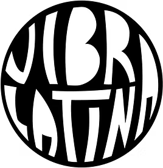
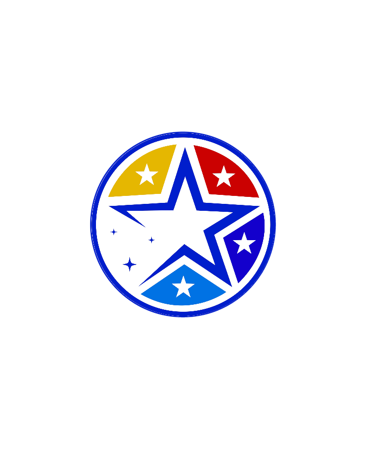

<div align="center">
  
  &nbsp;&nbsp;&nbsp;&nbsp;&nbsp;&nbsp;
  
  &nbsp;&nbsp;&nbsp;&nbsp;&nbsp;&nbsp;
  
</div>

# Astris

Conectando talento con entornos laborales adaptativos.

Astris es una plataforma web SPA que empareja talento diverso con **organizaciones** (privadas, públicas, educativas, sociales) comprometidas con la inclusión laboral real. No evalúa diagnósticos clínicos — evalúa **realidades operativas y necesidades de entorno** mediante un sistema de matching basado en estilos de trabajo, necesidades ambientales y ajustes razonables.

---

## Los 4 Pilares de Astris

| # | Pilar | Descripción |
|---|-------|-------------|
| 1 | **Adaptar** | Perfilado en 4 ejes operativos (Procesamiento, Tolerancia Ambiental, Ejecución, Ajustes Razonables) mediante cuestionario interactivo |
| 2 | **Acompañar** | Guía personalizada con mentor desde la preparación hasta el día 60 post-contratación, con check-ins y seguimiento estructurado |
| 3 | **Preparar** | Matching inteligente: compatibilidades calculadas objetivamente entre candidatos y organizaciones según modalidad, ajustes y entorno |
| 4 | **Conectar** | Matching, selección y post-contratación que cierra el ciclo inclusivo |

---

## Características

- Perfilado en 4 ejes: Procesamiento, Tolerancia Ambiental, Ejecución y Ajustes Razonables — cuestionario interactivo en 4 pasos
- Matching inteligente: Compatibilidades calculadas objetivamente entre candidatos y organizaciones según modalidad, ajustes y entorno
- Acompañamiento con mentor: Guía personalizada desde la preparación hasta el día 60 post-contratación, con check-ins y seguimiento
- 4 idiomas: Español (base), Inglés, Portugués y Francés — con detección automática del navegador
- Interfaz accesible: 4 paletas de colores personalizables (Calm Blue, Warm Earth, High Contrast, Natural Green), modo oscuro, fuente para dislexia (OpenDyslexic)
- Modo demo completo: Explora la plataforma sin backend con credenciales predefinidas para candidato, organización y mentor
- Sin backend requerido: Todo funciona offline con datos de demostración
- Code Splitting: Cada página se carga bajo demanda con React.lazy() — chunks de menos de 10 KB por página
- **Principio de Parametrización Universal**: Sin campos de texto libre — todo mediante selección parametrizada (SelectableCard, SelectableChip, CustomSlider)
- **Patrón Wizard + SplitScreen**: Flujos multi-paso con preview en vivo (60/40)

---

## Stack Tecnológico

| Capa | Tecnología | Versión |
|------|-----------|---------|
| Framework | React | 18 |
| Lenguaje | TypeScript | 6 (strict: true) |
| Build | Vite | 6 |
| Enrutamiento | React Router DOM | 7 (search params) |
| Estilos | Tailwind CSS | 4 |
| UI | Radix UI + Lucide Icons | latest |
| i18n | i18next + react-i18next | latest |
| Backend | Demo offline (sin backend) | — |
| Gráficos | Recharts (RadarChart) | 3 |
| Animaciones | Framer Motion | 12 |
| Formularios | react-hook-form | 7 |

Ver ARCHITECTURE.md para detalles técnicos completos.

---

## Instalación

```bash
git clone https://github.com/IANLAIN/Astris.git
cd Astris
npm install
npm run dev
```

La aplicación estará disponible en http://localhost:5173.

### Requisitos

- Node.js 18+
- npm 9+
- No se necesita conexión a internet ni variables de entorno. Todo funciona offline.

---

## Comandos Disponibles

| Comando | Descripción |
|---------|------------|
| npm run dev | Inicia servidor de desarrollo Vite con HMR |
| npm run build | Compila para producción (type-check + bundle) |
| npm run deploy | Despliega a GitHub Pages |
| npm run update-logo | Actualiza el logo desde SVG/PNG vectorizado |

---

## Modo Demo (sin backend)

Astris funciona completamente offline con datos de demostración. No necesitas configurar Supabase ni ninguna base de datos.

### Usuarios demo

La pantalla de inicio de sesión incluye botones de **acceso rápido** (Candidato, Organización, Mentor) traducidos en los 4 idiomas. También puedes ingresar manualmente:

| Rol | Email | Contraseña | Qué verás |
|-----|-------|-----------|-----------|
| Candidato | candidato@astris.org | Demo2026 | Perfil de Bryan González (TDAH, Ing. Sistemas), radar de compatibilidad, vacantes de organizaciones asociadas con % de match |
| Organización | organizacion@astris.org | Demo2026 | Dashboard de organizaciones, candidatos con compatibilidad, vacantes activas |
| Mentor | mentor@astris.org | Demo2026 | Dashboard de mentores, procesos activos, check-ins, organizaciones vinculadas |

> **Nota:** El email `empresa@astris.org` sigue funcionando como alias de organización para compatibilidad con versiones anteriores.

### Organizaciones demo

- **Vibra Latina** — Corporación audiovisual con sede en Houston, TX. Especializada en producción de contenido sobre responsabilidad social, educación y STEM para la comunidad hispana bilingüe. Vacantes: Desarrollador Full Stack (94% match) y Diseñador Gráfico (87% match).
- **Closer To The Stars Foundation** — Fundación sin fines de lucro dedicada a la divulgación científica y exploración espacial. Vacante: Gerente de Administración de Sistemas (82% match).

---

## Roles y Flujo

### Candidato
1. Onboarding: Configura paleta de colores, modo oscuro y fuente
2. Quiz de caracterización: 4 ejes × 4 preguntas sobre estilo de trabajo y necesidades
3. Perfil: Visualiza tu radar de compatibilidad con ajustes recomendados
4. Vacantes: Explora ofertas con porcentaje de match (organizaciones asociadas)
5. Selección de mentor: Elige acompañamiento profesional
6. Acompañamiento: Seguimiento pre y post-contratación

### Organización
1. Perfil organizacional: Define filosofía, ajustes y entorno laboral
2. Publicar vacantes: Describe el rol, modalidad y ajustes ofrecidos
3. Explorar candidatos: Visualiza perfiles con porcentajes de compatibilidad
4. Selección y post-contratación: Proceso de acompañamiento

### Mentor
1. Dashboard: Visualiza procesos activos y candidatos asignados con reportes de actividad
2. Check-ins: Realiza seguimiento estructurado
3. Organizaciones: Gestiona relaciones con organizaciones asociadas

---

## Estructura del Proyecto

```
src/
  App.tsx                   # Raíz: enrutamiento condicional + lazy loading + modales + tema
  main.tsx                  # Entry point: BrowserRouter + render
  assets/                   # Imágenes estáticas optimizadas
  components/
    common/                 # Componentes compartidos (NavBar, MatchBadge, RadarViz, SplitScreenLayout,
                            #   SelectableCard, SelectableChip, CustomSlider, etc.)
    modals/                 # LanguageModal, LoginModal, RegisterModal, UpdatePasswordModal
    ui/                     # Radix UI wrappers (button, dialog, card, dropdown-menu, etc.)
  hooks/                    # useAuth, useTheme, useCanGoBack
  i18n/                     # Traducciones (es, en, pt, fr) + configuración + datos estáticos
  services/
    demoData.ts             # TODOS los datos de demostración
    supabase.ts             # API demo: auth, matching, checkins
  pages/                    # Páginas organizadas por rol
    public/                 # LandingPage, AboutPage, SupportPage, PartnersPage
    candidate/              # Onboarding, Quiz, Profile, Vacancies, Mentor, Accompaniment
    organization/           # OrgOnboarding (wizard), OrgProfile, PostVacancy (wizard),
                            #   Candidates, CandidateDetail, PostHire
    mentor/                 # Dashboard, Checkins, Organizations
    shared/                 # NotFoundPage, SettingsPage
  styles/                   # CSS global (Tailwind v4, tema, fuentes)
  types/                    # Tipos TypeScript compartidos
```

---

## Despliegue

```bash
npm run build
npm run deploy
```

El sitio se publica en https://astris.port0.org.

También puedes copiar el contenido de dist/ a cualquier hosting estático (Netlify, Vercel, Cloudflare Pages).

Nota: Al ser una app 100% offline con datos demo, no se necesita configuración de servidor backend ni variables de entorno.

---

## Principios de Desarrollo

| Principio | Descripción |
|-----------|-------------|
| Code Splitting | Toda página se carga con React.lazy(). Prohibido imports estáticos de páginas. |
| Parametrización Universal | Ningún campo en perfiles puede ser texto libre. Todo mediante selección parametrizada (SelectableCard, SelectableChip, CustomSlider). |
| Wizard + SplitScreen | Flujos multi-paso con preview en vivo 60/40, no scroll infinito. |
| DRY | Lógica repetida a hooks. API calls a servicios. JSX repetido a componentes. |
| Modularidad | 1 archivo = 1 componente/hook/servicio. Carpetas por rol y tipo. |
| Límite de tamaño | Archivos máximo 150 líneas. Funciones máximo 40 líneas. Componentes máximo 100 líneas JSX. |
| i18n first | Todo texto visible en 4 idiomas. Prohibido texto hardcodeado. |
| Sin archivos basura | Sin .bak, .old, temporales, logs, o datos personales en el repo. |
| Sin store global | Estado local en hooks + URL + localStorage. Sin Context API, Redux o Zustand. |
| Sin backend | Todo funciona offline con datos demo. No hay dependencia externa. |
| Nomenclatura | "Organización", no "Empresa". Usa `organization` en variables, rutas y traducciones. |

Ver CONTRIBUTING.md para la guía completa de contribución.

---

## Documentación

- ARCHITECTURE.md — Decisiones técnicas, estructura del código, flujos de autenticación y enrutamiento
- CONTRIBUTING.md — Guía para contribuir: estándares de código, code splitting, i18n, DRY, limpieza de archivos

---

## Licencia

ISC 2025-2026 Astris

---

## Agradecimientos

- Vibra Latina (https://www.vibralatinatx.com/) — Inspiración y apoyo
- The Genuine Foundation (https://genuinecup.org/) — Colaboración en inclusión laboral
- Todos los contribuyentes y personas que hacen posible este proyecto
