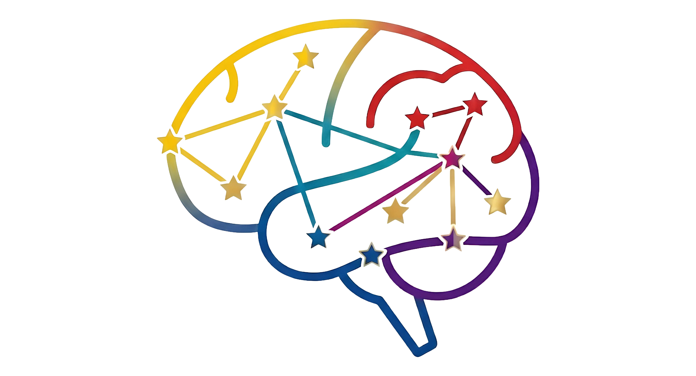

<p align="center">
  
</p>

# Astris

**Plataforma de Transición Laboral Adaptativa**

> "No preguntamos qué condición tienes. Preguntamos cómo trabajas mejor."

Astris es un prototipo de plataforma web diseñado para facilitar la inserción laboral de personas con diferentes estilos cognitivos, sensoriales y de aprendizaje, con énfasis en TDAH, autismo y síndrome de Down. En lugar de operar desde diagnósticos médicos, Astris perfila a los candidatos según cómo funcionan en el trabajo y hace match con empresas según sus condiciones reales de entorno y accesibilidad.

Este repositorio contiene los archivos de diseño, documentación, brief del proyecto y guías de sistema para el prototipo navegable presentado en el **Houston Experience 2026**, dentro del programa **Closer to the Stars Educational Program**, ante Genuine Foundation y Microsoft ION.

---

## El problema

Los sistemas de empleo tradicionales asumen que todas las personas procesan información, se comunican y ejecutan tareas de la misma manera. Esta suposición genera barreras invisibles que excluyen a personas neurodivergentes no por falta de capacidad, sino por incompatibilidad de contexto.

Entre el **70% y el 85%** de las personas en el espectro autista en edad de trabajar se encuentran desempleadas o subempleadas. La rotación laboral involuntaria en perfiles con TDAH es hasta **tres veces mayor** que en la población general. El problema no es de capacidad: es de compatibilidad y entorno.

---

## La solución

Astris construye un sistema de compatibilidad laboral adaptativa que es **ciego al diagnóstico pero preciso en compatibilidad real**. Una persona con autismo y una persona con migrañas crónicas pueden compartir exactamente los mismos parámetros ambientales. La plataforma los empareja con las mismas empresas sin exponer información médica privada.

### Los cuatro pilares

| Pilar | Descripción |
|---|---|
| **Preparar** | Desarrollo de habilidades y confianza para el entorno laboral |
| **Adaptar** | Interfaz personalizable según perfil cognitivo y sensorial |
| **Acompañar** | Mentores especializados que median entre candidato y empresa |
| **Conectar** | Match entre perfiles y vacantes basado en compatibilidad real |

### Las cuatro fases del proceso

```
Fase 1: Perfil y Adaptación
    ↓
Fase 2: Matching Laboral
    ↓
Fase 3: Entrenamiento Personalizado
    ↓
Fase 4: Inserción y Seguimiento
```

---

## Sistema de perfilamiento

El corazón diferencial de Astris es su cuestionario de 4 ejes, que sustituye la pregunta "¿Cuál es tu diagnóstico?" por "¿Cómo trabajas mejor?". Las respuestas alimentan un **diagrama de araña dinámico** que construye el perfil visual del candidato en tiempo real.

**Eje 1 — Procesamiento y Comunicación**
Cómo el candidato recibe, procesa y entrega información: interacción social, retroalimentación, formato de entrada preferido, estilo de comunicación.

**Eje 2 — Tolerancia Ambiental**
En qué condiciones físicas y sensoriales trabaja mejor: carga auditiva, carga visual, estructura del espacio, tolerancia a interrupciones.

**Eje 3 — Ejecución y Tareas**
Cómo funciona su cerebro al trabajar: foco y atención, estructura de la tarea, manejo del tiempo, profundidad vs. amplitud.

**Eje 4 — Ajustes Razonables**
Qué herramientas físicas o de software requiere: hardware accesible, software de apoyo, necesidad de mentor, modalidad de trabajo.

El mismo modelo de ejes se aplica a las empresas para caracterizar su entorno y vacantes, haciendo el matching posible sin intermediarios subjetivos.

---

## Prototipo

El prototipo navegable está diseñado en **Figma**, es desktop-first (1440px) y cubre 20 pantallas organizadas en tres flujos:

- **Flujo candidato** — 14 pantallas, desde el selector de paleta de colores hasta el panel de seguimiento post-contratación.
- **Flujo empresa** — 5 pantallas, desde la caracterización organizacional hasta el seguimiento del colaborador.
- **Componente transversal** — asistente conversacional guiado con preguntas preconfiguradas y respuestas de selección múltiple.

> El prototipo no tiene backend funcional. Todos los datos (candidatos, empresas, mentores, porcentajes de compatibilidad) son contenido de ejemplo coherente y curado para comunicar el flujo real del producto.

### Ver prototipo

🔗 **[Abrir en Figma](#)** *(enlace disponible próximamente)*

---

## Estructura del repositorio

```
astris/
├── docs/
│   ├── Brief_Astris_Houston2026.pdf     # Brief completo del proyecto
│   └── Houston_Experience_2026.pdf      # Itinerario y contexto del programa
├── design/
│   ├── Guidelines.md                    # Sistema de diseño para Figma Make
│   └── Prompt_FigmaMake_Astris.md       # Prompt de generación del prototipo
├── assets/
│   └── logotipo/                        # Variantes del logotipo
└── README.md
```

---

## Sistema de diseño

### Paleta de marca

```
Primario    #1B4B7A   Azul profundo — headers, botones, navegación
Acento      #2E86AB   Teal — links, estados activos, interactivos secundarios
Highlight   #C9830A   Ámbar — badges de compatibilidad, callouts (uso limitado)
Fondo       #F7FAFC   Off-white (nunca blanco puro)
Texto       #1A1A2E   Off-black (nunca negro puro)
Secundario  #4A5568   Texto de apoyo
```

### Tipografía

- **Principal:** Atkinson Hyperlegible — diseñada para baja visión y diversidad perceptual.
- **Alternativa:** Inter — legibilidad optimizada en pantalla.
- **Tamaño base mínimo:** 16px. Todo ícono acompañado de texto descriptivo.

### Paletas personalizables (flujo candidato)

El candidato elige su paleta durante el registro. Cada opción tiene versión modo claro y oscuro, y está estudiada para distintos perfiles de sensibilidad sensorial:

1. **Azul neutro** — bajo estímulo visual
2. **Tierra cálida** — reduce contraste duro
3. **Alto contraste** — máxima legibilidad
4. **Verde salvia** — calmante para sesiones largas

### Principios de accesibilidad aplicados

- Sin blanco puro ni negro puro en ningún contexto.
- Sin animaciones automáticas por defecto (toggle "Reducir movimiento" disponible).
- Botones de mínimo 44px de alto con estados hover/focus visibles.
- Lenguaje literal y directo: sin metáforas, sin ambigüedad, sin íconos sin texto de apoyo.

---

## Principios éticos

Cada decisión de diseño en Astris pasa por un filtro antes de implementarse:

> **"¿Esto reduce barreras o solo clasifica personas?"**

| Principio | Aplicación |
|---|---|
| **No etiquetar** | El perfil describe comportamientos y preferencias, nunca categorías médicas |
| **No infantilizar** | Tono profesional y directo, sin condescendencia ni "ayuda social" |
| **No invadir** | Solo se solicita información necesaria para el matching; lo sensible es voluntario |
| **Integrar, no separar** | No existe una categoría de "empleos para personas con discapacidad" |
| **Concepto antes que desarrollo** | Cada funcionalidad tiene un "por qué" claro antes de construirse |

---

## Alcance del proyecto

| Sí es Astris | No es Astris |
|---|---|
| Landing page profesional con propuesta de valor | Aplicación de salud mental o plataforma clínica |
| Prototipo navegable de alta fidelidad | Sistema de backend funcional o bolsa de empleo operativa |
| Simulación del flujo de registro y perfilamiento | Base de datos real de candidatos o empresas |
| Sistema de personalización visual del entorno | Motor de IA generativa o matching automatizado en producción |
| Modelo de acompañamiento por mentores | Servicio de asistencia psicológica o terapéutica |
| Concepto escalable con hoja de ruta LatAm + USA | Desarrollo complejo de infraestructura tecnológica inmediata |

---

## Hoja de ruta

```
Etapa 1 — Prototipo y Validación                         [Actual]
  Presentación ante Genuine Foundation y Microsoft ION
  Houston Experience 2026, julio 24 - agosto 2
  Validación del concepto con comunidades neurodivergentes reales

Etapa 2 — Desarrollo e Implementación Piloto             [Futuro]
  Desarrollo tecnológico (posible integración con Microsoft Azure)
  IA aplicada al aprendizaje adaptativo
  Piloto con empresas aliadas en Colombia

Etapa 3 — Expansión Regional                             [Futuro]
  Escalar el modelo a LatAm y USA
  Alianzas internacionales con organizaciones como Genuine Foundation
```

---

## Contexto del proyecto

Astris nació en el marco del **Closer to the Stars Educational Program**, un programa de formación de líderes jóvenes de Cartago, Colombia, que viajan al **Houston Experience 2026** (julio 24 - agosto 2). El equipo fue seleccionado para presentar soluciones tecnológicas de impacto social ante:

- **Genuine Foundation** — Genuine Connect Conference, Rice University
- **Microsoft ION** — Oficinas de innovación, Houston
- **Puerto de Houston** — Programa Global Trade & Entrepreneurial Mindset Lab
- **Space Center Houston** — Presentación del impacto educativo del programa

El proyecto se presenta bajo el nombre **Inclusion Tech Lab** como propuesta de colaboración para el desarrollo de soluciones tecnológicas inclusivas escalables.

---

## Equipo

| Rol | Responsabilidad |
|---|---|
| **Bryan** | Desarrollo tecnológico, arquitectura del prototipo, documentación |
| **Isabella** | Piloto del proyecto, speech y presentación pública |
| **Johan** | Co-piloto tecnológico, presentación Microsoft |
| **Delanny / Deisy** | Co-pilotos de presentación y desafío aplicado |
| **Gabby / Luis / César** | Pilotos del módulo Puerto de Houston |

---

## Decisiones pendientes

- [ ] Confirmar nombre final de la plataforma *(candidato actual: Astris)*
- [ ] Definir paletas de colores definitivas para los 4 modos visuales
- [ ] Establecer número y redacción final de preguntas por eje del cuestionario
- [ ] Validar texto del cuestionario con profesionales especializados
- [ ] Confirmar tipografía principal (candidatas: Atkinson Hyperlegible, Inter)

---

## Licencia

Este proyecto es una propuesta conceptual desarrollada en el marco del Closer to the Stars Educational Program. Los materiales de diseño y documentación son propiedad del equipo. El código fuente, cuando exista, se publicará bajo licencia MIT.

---

*Closer to the Stars Educational Program · Houston Experience 2026 · Cartago, Colombia*
